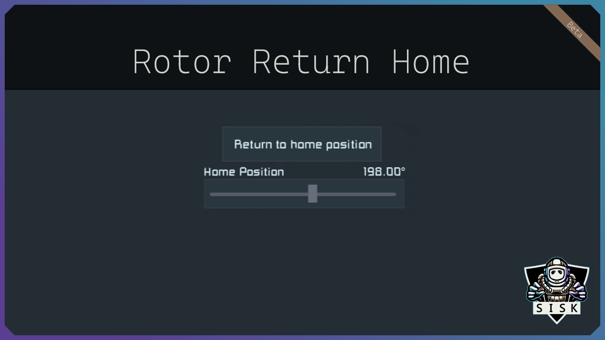

# Rotor Return Home

- [Rotor Return Home](#rotor-return-home)
  - [🛠︰Info](#info)
  - [🛠︰ Programableblock API](#-programableblock-api)
    - [🛠︰Actions](#actions)
    - [🛠︰Properties](#properties)
  - [🛠︰Installation](#installation)
  - [🛠︰Support](#support)

## 🛠︰Info

This simple yet useful mod for Space Engineers allows players to easily return their rotors to their home position with just the press of a terminal button.
No more manual adjustments or scripts required!

Adds a button to start return the rotor to home position and a slider to set the home position angle to rotor terminal controls.

❗❗❗ Currently only advanced rotors and hinges are supported because of a bug.
If you really want support for it please vote for this at least 3 years old [bug report](https://support.keenswh.com/spaceengineers/pc/topic/mod-api-terminal-controls-cannot-be-added-to-rotors)❗❗❗

## 🛠︰ Programableblock API

you can also use this mod in your own scripts by using the following actions and properties

### 🛠︰Actions

* ReturnToHome: Return to home position
* ResetHomePositionAngle: Reset home position angle
* IncreaseHomePositionAngle: Increase home position angle
* DecreaseHomePositionAngle: Decrease home position angle
* DisableRotorWhenHomeAngleReached: Disable rotor when hp reached On/Off

### 🛠︰Properties

* HomePositionAngle: float
* DisableRotorWhenHomeAngleReached: bool

## 🛠︰Installation

The easiest way is to download it from [SteamWorkshop](https://steamcommunity.com/sharedfiles/filedetails/?id=3148640475).

You can also download the latest zip from [releases](https://github.com/SiskSjet/RotorReturnHome/releases) and extract it to your '%appdata%\SpaceEngineers\Mods' folder

## 🛠︰Support

It would be nice if you could consider supporting me 

  

or join my [Discord](https://discord.gg/2s22YCqSFg) if you have suggestions, wishes, or just want to know what else I'm working on. My Discord is new, so there is not much going on yet.
You can also check out my other mods in my [Workshop](https://steamcommunity.com/id/sisksjet/myworkshopfiles/?appid=244850).
